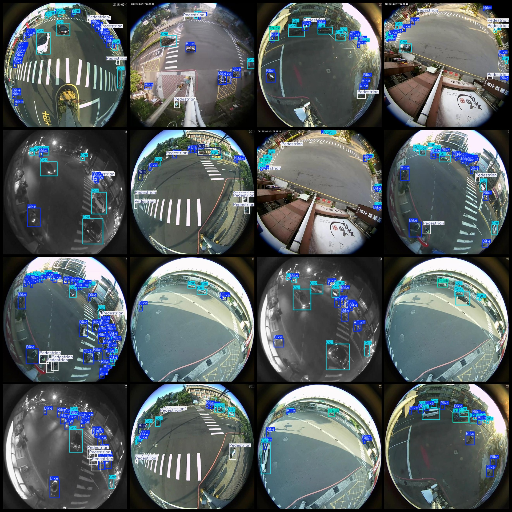
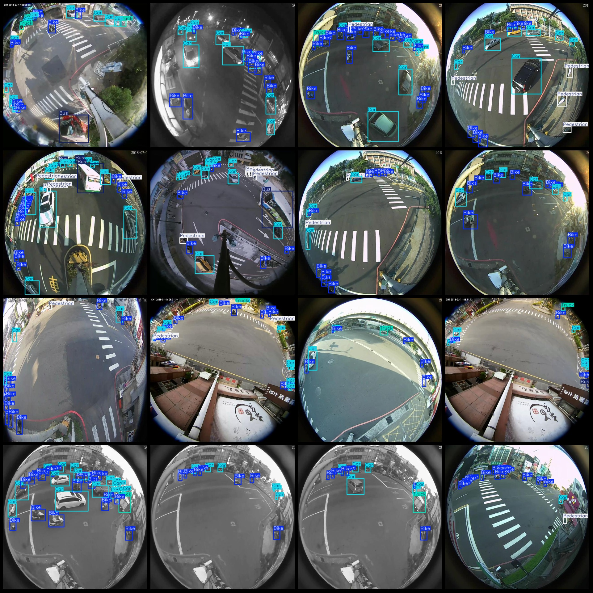

# Intelligent Traffic Fisheye Camera Image Dataset for Vehicle, Pedestrian, and Traffic Pedestrian Detection in Pascal VOC+YOLO Format (7836 Images in 5 Classes)

Dataset format: Pascal VOC format + YOLO format (without split path in txt file, only including JPG images and corresponding VOC format xml files and YOLO format txt files)
Number of images (JPG file count): 7836
Number of annotations (xml file count): 7836
Number of annotations (txt file count): 7836
Number of annotation categories: 5
Annotation category names (note that the order of labels in the YOLO format does not correspond to this, but is based on the labels folder "classes.txt"): ["Bike", "Bus", "Car", "Pedestrian", "Truck"]
Number of bounding boxes per category:
- Bike (Bicycle) Bounding Boxes = 85515
- Bus (Bus) Bounding Boxes = 2931
- Car (Car) Bounding Boxes = 49423
- Pedestrian (Pedestrian) Bounding Boxes = 11490
- Truck (Truck) Bounding Boxes = 3246
Total bounding boxes: 152605
Number of images per category:
- Bike (Bicycle) Images = 7736
- Bus (Bus) Images = 2277
- Car (Car) Images = 7672
- Pedestrian (Pedestrian) Images = 4506
- Truck (Truck) Images = 2500
Image resolution: 640x640
Annotation tool used: labelImg
Annotation rules: Draw a bounding box around each category
Important note: The dataset does not have separate training, validation, or test sets; they must be manually divided.
Special statement: This dataset does not guarantee any accuracy in the models trained on it or the weights files.
Image preview:

## Image

Here is a pay link on Stripe ( https://buy.stripe.com/3cs8yP7sY87d0vu9AB ). Please contact me lonlonago@foxmail.com after funding $89, and I will send you a complete data files , thank you!

